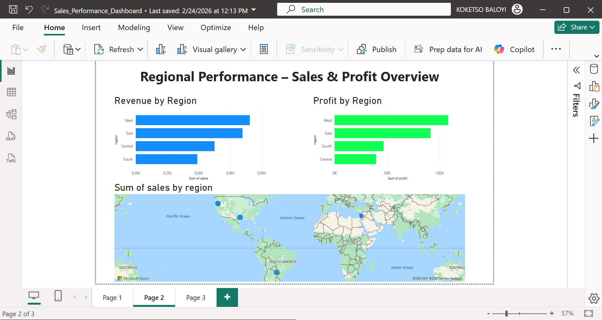
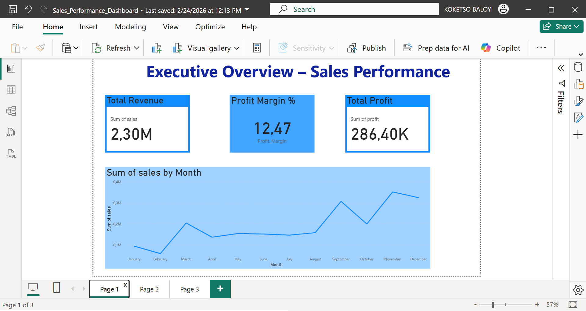

# **Sales Performance Dashboard: SQL and Power BI **

## *Project Overview*

This project is an end-to-end business intelligence workflow built with SQL Server and Power BI. Raw retail sales data was cleaned and transformed in SQL, then used to build an interactive dashboard that evaluates:

* Revenue trends
* Regional performance
* Profitability
* Business risk areas (loss-making products and low-margin categories)

## Tools and Technologies

* SQL Server Management Studio (T-SQL)
* Power BI Desktop
* DAX (basic measures)
* GitHub (version control and documentation)

## Dataset

The analysis uses the public sample Superstore retail dataset (Data/sample-Superstore.csv).

## Data Preparation (SQL)

The raw data was cleaned and transformed using SQL.

Key steps:

* Created a structured analysis table (sales_data)
* Converted date columns using TRY_CAST
* Standardised numeric data types (DECIMAL, INT)
* Checked for missing and invalid values
* Identified negative and null records
* Validated sales and profit consistency

KPIs calculated in SQL:

* Monthly revenue trend
* Top 10 customers by total spend
* Profit margin percentage by category
* Identification of loss-making products
* Revenue and profit by region

SQL script: sql/sales_data_cleaning_and_analysis.sql

## Power BI Dashboard

The cleaned dataset was imported into Power BI to build an interactive dashboard with three pages.

### 1. Executive Overview

Total revenue, total profit, monthly revenue trend and an overall performance summary.

### 2. Regional Performance

Revenue and profit by region, with a comparison across regions.

### 3. Risk and Loss Analysis

Loss-making products, low-margin categories and profitability risks.

## Key Insights

* Identified the regions contributing the highest revenue and profit
* Detected products generating consistent losses
* Highlighted categories with low profit margins
* Provided data-driven insights to support strategic decision-making

## Project Structure

* Data/ : sample Superstore dataset
* sql/ : data cleaning and analysis script
* PowerBi/ : Power BI dashboard file (.pbix)
* images/ : dashboard screenshots
* README.md
